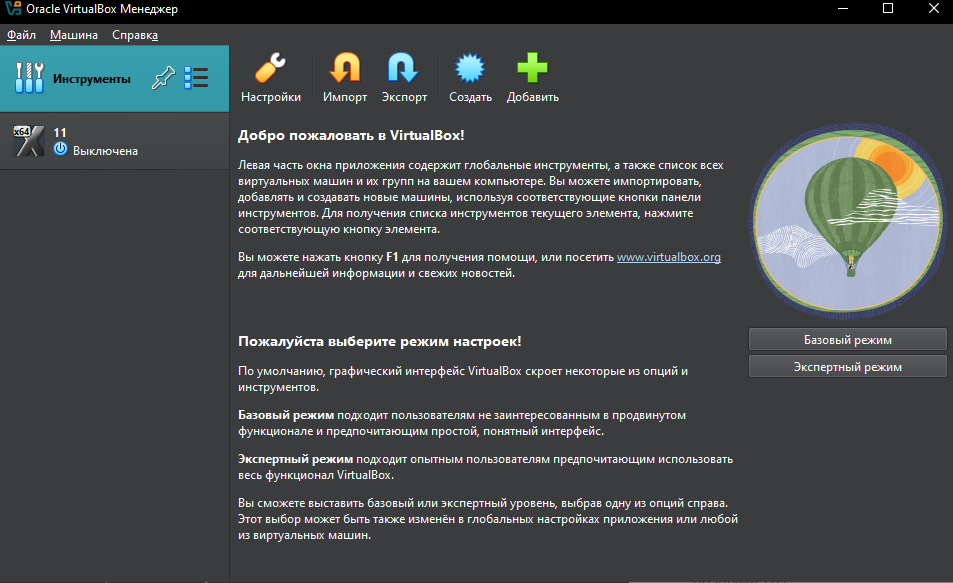
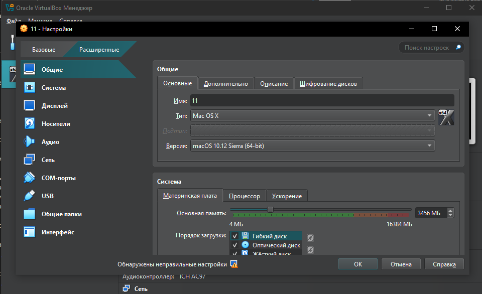
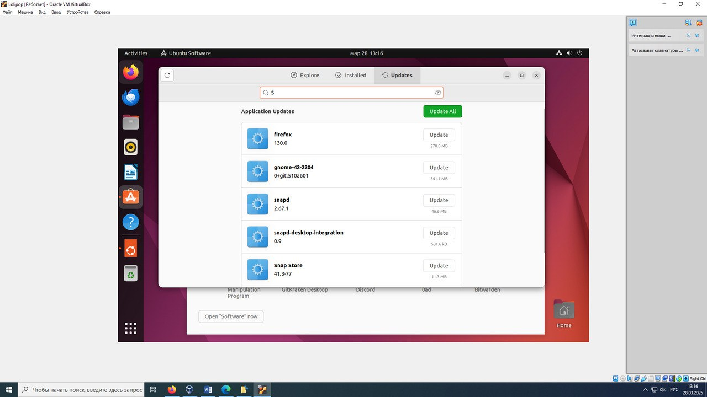
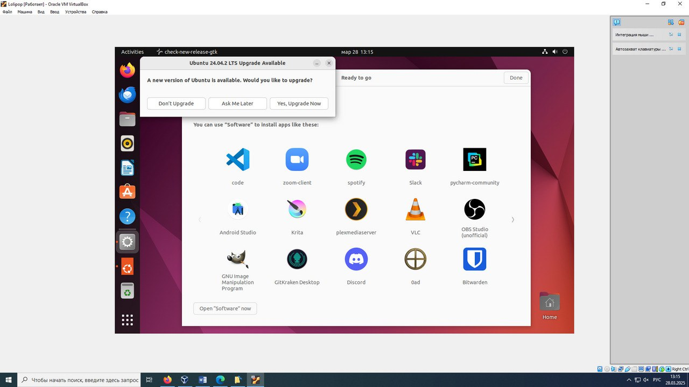
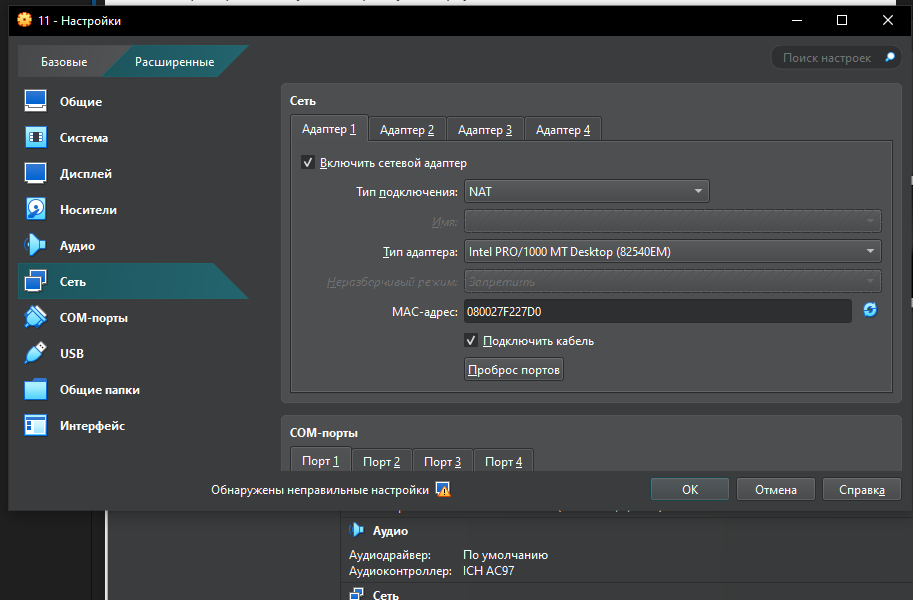
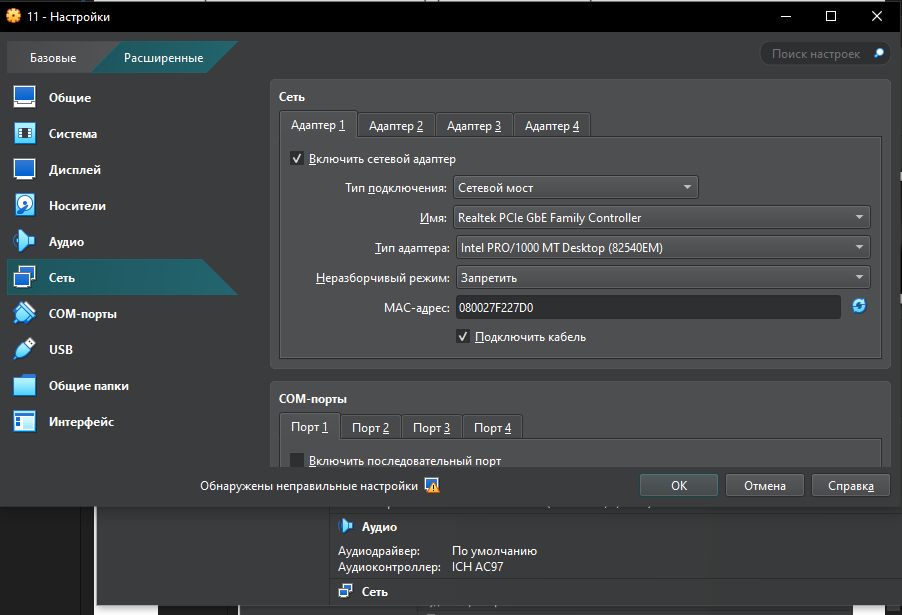
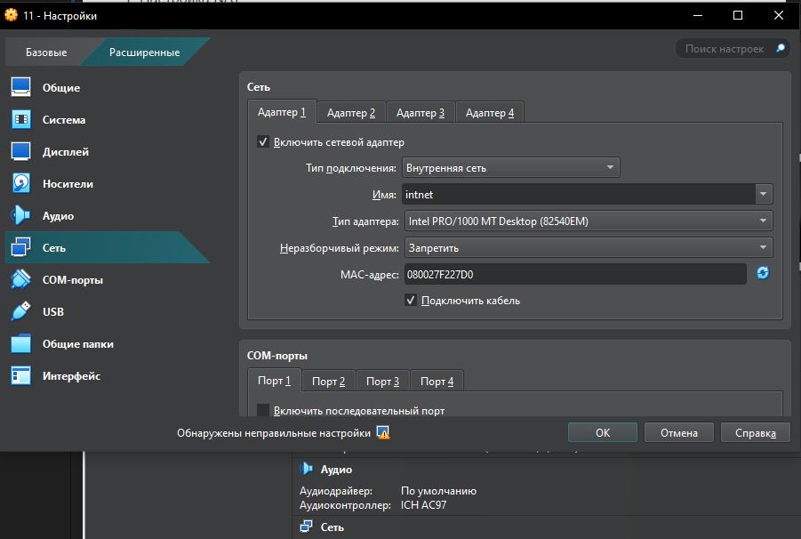
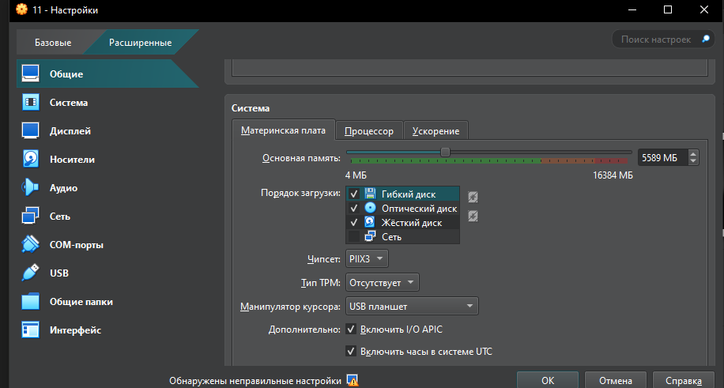
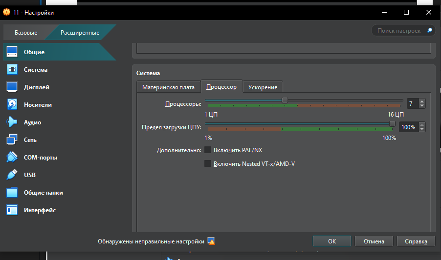

Задание 1: Установка VirtualBox и создание виртуальной машины
1.	Установка VirtualBox:
•	Загрузите и установите последнюю версию VirtualBox на ваш компьютер.
•	Убедитесь, что VirtualBox успешно запускается и функционирует.

2.	Создание виртуальной машины:
•	Создайте новую виртуальную машину для установки операционной системы Mac или Linux (например, Ubuntu).

•	Настройте параметры виртуальной машины: назначьте необходимое количество оперативной памяти и создайте виртуальный жесткий диск.

Задание 2: Установка операционной системы в виртуальной машине
1.	Установка Mac:
•	Загрузите образ ISO Mac .
•	Установите Mac в созданной виртуальной машине.
•	Настройте сетевые подключения и подключите интернет.

2.	Установка Linux (Ubuntu):
•	Загрузите образ ISO Ubuntu.
•	Установите Ubuntu в отдельной виртуальной машине.

•	Настройте сетевые подключения и подключите интернет.

Задание 3: Настройка и сравнение операционных систем
1.	Настройка ОС:
•	Установите необходимые драйверы и обновления для каждой ОС.
Для убунты

•	Настройте пользовательский интерфейс и базовые настройки системы.
В маке все настроилось

Задание 4: Настройка сетевых подключений в VirtualBox
1.	Настройка NAT:
•	Создайте виртуальную машину с сетевым адаптером, настроенным на NAT.
•	Проверьте доступ к интернету из виртуальной машины. - Успешно

2.	Настройка Bridged:
•	Измените сетевой адаптер на Bridged.
•	Проверьте доступ к локальной сети и интернету.

3.	Настройка Host-Only:
•	Настройте сетевой адаптер на Host-Only.
•	Проверьте возможность обмена данными между хостом и виртуальной машиной.

Задание 5: Управление ресурсами виртуальной машины
1.	Управление оперативной памятью:
•	Измените объем оперативной памяти, выделенной виртуальной машине.
•	Проверьте влияние на производительность.

2.	Управление процессорами:
•	Измените количество ядер процессора, доступных виртуальной машине.
•	Проверьте влияние на производительность.

Задание 6: Использование снимков виртуальных машин
1.	Создание снимка:
•	Создайте снимок виртуальной машины в определённом состоянии.
•	Проверьте возможность восстановления состояния из снимка.
2.	Восстановление из снимка:
•	Внесите изменения в виртуальную машину после создания снимка.
•	Восстановите состояние из снимка и проверьте, что изменения были отменены.
Задание 7: Настройка общего буфера обмена и папок
1.	Настройка общего буфера обмена:
•	Включите общий буфер обмена между хостом и виртуальной машиной.
•	Проверьте возможность копирования и вставки данных между системами.
2.	Настройка общих папок:
•	Настройте общую папку между хостом и виртуальной машиной.
•	Проверьте возможность обмена файлами между системами.
